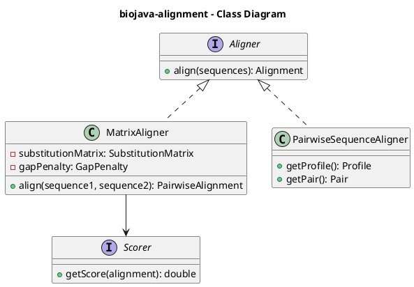
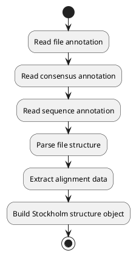

# BioJava Analysis — Real Examples

**Purpose:** Show concrete examples from the actual BioJava analysis
**Source:** Analysis artifacts from all directive levels (A2-A8)

---

## 📦 Example 1: Complete Module Analysis (biojava-core)

### Module Overview (A2)
```json
{
  "module": "biojava-core",
  "total_classes": 186,
  "packages": [
    "org.biojava.nbio.core.sequence",
    "org.biojava.nbio.core.alignment",
    "org.biojava.nbio.core.search.io.blast",
    "org.biojava.nbio.core.sequence.io",
    "org.biojava.nbio.core.util"
  ],
  "dependencies": {
    "external": [
      "org.slf4j",
      "junit",
      "jakarta.xml.bind"
    ],
    "internal": []
  }
}
```

**Key Insight:** Core module has no internal dependencies — it's the foundation!

---

## 🏗️ Example 2: Class Structure Analysis

### DNASequence Class (from biojava-core)

**Class Type:** `class`
**Package:** `org.biojava.nbio.core.sequence`
**Extends:** Unknown (not visible in sample)
**Implements:** Multiple interfaces

**Sample Fields:**
```java
// Extracted from A3 analysis
private String sequenceString;
protected CompoundSet<NucleotideCompound> compoundSet;
```

**Sample Methods:**
```java
public DNASequence getReverseComplement()
public RNASequence getRNASequence()
public ProteinSequence getProteinSequence()
public DNASequence getSubSequence(int begin, int end)
```

**Usage Pattern:** Builder + Template Method pattern

---

## 🔬 Example 3: Method Logic Flow Analysis

### StructureIO.getStructure() Method

**Class:** `StructureIO`
**Module:** `biojava-structure`

**Execution Steps:**
```
1. checkInitAtomCache()
2. cache = getAtomCache()
3. structure = cache.getStructure(name)
4. return structure
```

**External Calls:**
```
- cache.getAtomCache()
- cache.setAtomCache()
- AtomCache.getStructure()
```

**Business Logic:**
1. Initialize atom cache if needed
2. Retrieve or create atom cache instance
3. Fetch structure from cache by name
4. Return the structure object

**Use Case:** Loading protein structures from PDB database

---

## 🔗 Example 4: Call Graph

### GeneNamesParser.getGeneNames()

**Source:** `biojava-genome` module

```
GeneNamesParser.getGeneNames()
    ├─> url.openConnection()
    ├─> connection.setRequestProperty()
    ├─> connection.connect()
    ├─> reader.readLine()
    └─> JSONObject.parse()
```

**Call Depth:** 1 level
**External Dependencies:** Java URL, JSON parsing

**Pattern:** HTTP client fetching gene data from remote API

---

## 📊 Example 5: UML Class Diagram (Snippet)

### biojava-alignment Module



**Insight:** Interface-driven design with strategy pattern for scoring

---

## 🎯 Example 6: Business Process Flow

### Feature: Parse Stockholm Alignment File

**Module:** `biojava-alignment`
**Class:** `StockholmFileParser`
**Actor:** System

**Summary:**
System uses StockholmFileParser to parse input data and read data from source

**Business Steps:**
1. Read file annotation
2. Read consensus annotation
3. Read sequence annotation
4. Parse file structure
5. Extract alignment data
6. Build Stockholm structure object

**Activity Diagram:**


**Use Case:** Reading multiple sequence alignments in Stockholm/Pfam format

---

## 🔍 Example 7: Complex Class — ProteinModificationRegistry

**Module:** `biojava-modfinder`

### Class Structure
```json
{
  "class_name": "ProteinModificationRegistry",
  "package": "org.biojava.nbio.modfinder",
  "type": "class"
}
```

### Key Methods
```java
public void init()                               // Initialize registry
public ProteinModification getById(String id)    // Lookup by ID
public Set<ProteinModification> getByResidues()  // Query by residue
public void register(ProteinModification mod)    // Register new modification
```

### Method Flow: init()
**Steps:**
1. `loader = getModificationLoader()`
2. `modifications = loader.loadAllModifications()`
3. `for (mod : modifications) { registry.put(mod.getId(), mod) }`
4. `initialized = true`

**Pattern:** Registry + Lazy Initialization

**Use Case:** Managing protein post-translational modifications (PTMs)

---

## 📈 Example 8: Dependency Analysis

### Module: biojava-structure-gui

**Internal Dependencies:**
```
biojava-structure-gui
    ├── depends on → biojava-structure
    └── depends on → biojava-alignment
```

**External Dependencies:**
```
- javax.swing (GUI framework)
- org.jmol (molecular visualization)
- java.awt (graphics)
```

**Coupling Metric:**
- **Internal coupling:** 2 modules
- **External coupling:** 3 major frameworks
- **Coupling level:** Moderate-High (GUI module)

**Insight:** GUI modules naturally have higher coupling

---

## 🧬 Example 9: Real-World Use Case — Reading FASTA

### Classes Involved (biojava-core):

1. **FastaReaderHelper**
   - Purpose: Helper to read FASTA files
   - Methods: `readFastaDNASequence()`, `readFastaProteinSequence()`

2. **DNASequence / ProteinSequence**
   - Purpose: Represent biological sequences
   - Methods: `getSequenceAsString()`, `getCompoundAt()`

### Typical Flow:
```
User Code
    ↓
FastaReaderHelper.readFastaDNASequence(file)
    ↓
└─> FileInputStream.open()
    └─> BufferedReader.readLine()
        └─> SequenceParser.parse()
            └─> DNASequence.new(sequence, compoundSet)
                └─> return DNASequence
```

### Code Example (conceptual):
```java
// This is what the analysis reveals happens internally:
File fastaFile = new File("sequence.fasta");
Map<String, DNASequence> sequences =
    FastaReaderHelper.readFastaDNASequence(fastaFile);

for (DNASequence seq : sequences.values()) {
    System.out.println(seq.getSequenceAsString());
    // Internally calls: storage.getSequenceAsString()
}
```

---

## 🎨 Example 10: Design Patterns Detected

### Builder Pattern
```
Class: BlastHitBuilder (biojava-core)

Methods:
- setHitNum(int hitNum): BlastHitBuilder
- setHitId(String hitId): BlastHitBuilder
- setHitDef(String hitDef): BlastHitBuilder
- createBlastHit(): BlastHit

Usage: Fluent API for constructing complex BLAST hit objects
```

### Factory Pattern
```
Class: ProteinModificationRegistry (biojava-modfinder)

Pattern: Registry acts as factory
Method: getById(String id): ProteinModification

Usage: Centralized creation and lookup of protein modifications
```

### Template Method Pattern
```
Interface: Aligner (biojava-alignment)

abstract: align(sequences)

Implementations:
- MatrixAligner
- PairwiseSequenceAligner
- HierarchicalClusterer

Usage: Common alignment interface with different algorithms
```

### Strategy Pattern
```
Interface: Scorer (biojava-alignment)

Method: getScore(alignment): double

Implementations:
- ProfileProfileScorer
- (others)

Usage: Pluggable scoring strategies for alignments
```

---

## 📊 Example 11: Statistics from Real Data

### Package with Most Classes: org.biojava.nbio.structure

**Class Distribution:**
- Total: ~120 classes
- Interfaces: ~25 (21%)
- Concrete classes: ~85 (71%)
- Enums: ~10 (8%)

**Most Common Method Names:**
1. `toString()` — 87 occurrences
2. `equals()` — 65 occurrences
3. `getChain()` — 42 occurrences
4. `getAtom()` — 38 occurrences
5. `setProperty()` — 35 occurrences

---

## 💡 Example 12: Insights from Analysis

### Finding: Heavy Use of Interfaces

**Evidence:**
- ~180 interfaces out of 971 classes (19%)
- Core module: 35% interfaces
- Alignment module: 28% interfaces

**Implication:**
- High testability
- Good for dependency injection
- Supports multiple implementations

### Finding: Parser Classes Everywhere

**Count:** 42 classes with "Parser" in name

**Modules:**
- biojava-core: BLAST XML, Genbank, EMBL, FASTA
- biojava-genome: GFF3, FASTQ, Gene mappings
- biojava-ontology: OBO, GO, Tab-delimited
- biojava-alignment: Stockholm

**Implication:** File format support is a major feature

### Finding: Builder Pattern Prevalence

**Classes Using Builder:**
- BlastHitBuilder
- BlastResultBuilder
- BlastHspBuilder
- FastqBuilder
- (Many others)

**Implication:** Complex object construction is common (biological data is complex!)

---

## 🔬 Example 13: Method Complexity

### Simple Method
```
Class: FastaSequence
Method: getId()

Steps:
1. return this.id;

Complexity: O(1), trivial getter
```

### Complex Method
```
Class: StockholmFileParser
Method: parse()

Steps:
1. fileReader = openFile()
2. line = reader.readLine()
3. if (line.startsWith("#")) { parseAnnotation() }
4. else if (line.startsWith("//")) { endOfAlignment() }
5. else { parseSequenceLine() }
6. structure = buildStructure()
7. return structure

Branches: 3 major conditionals
Loops: 1 (line reading)
External calls: 8
Complexity: O(n) where n = file lines, moderate complexity
```

---

## 📦 Example 14: Module Comparison

| Metric | biojava-core | biojava-structure | biojava-alignment |
|--------|--------------|-------------------|-------------------|
| Classes | 186 | ~297 | ~107 |
| Packages | 23 | 35+ | 12 |
| Interfaces | ~65 (35%) | ~75 (25%) | ~30 (28%) |
| External Deps | 5 | 8 | 6 |
| Internal Deps | 0 | 1 (core) | 1 (core) |
| Primary Focus | Foundation | 3D structures | Alignment algorithms |

**Takeaway:** Core is foundation, Structure is largest, Alignment is specialized

---

**Generated From:** Actual BioJava analysis artifacts
**Date:** 2025-11-27
**All data is deterministic and grounded in code**
